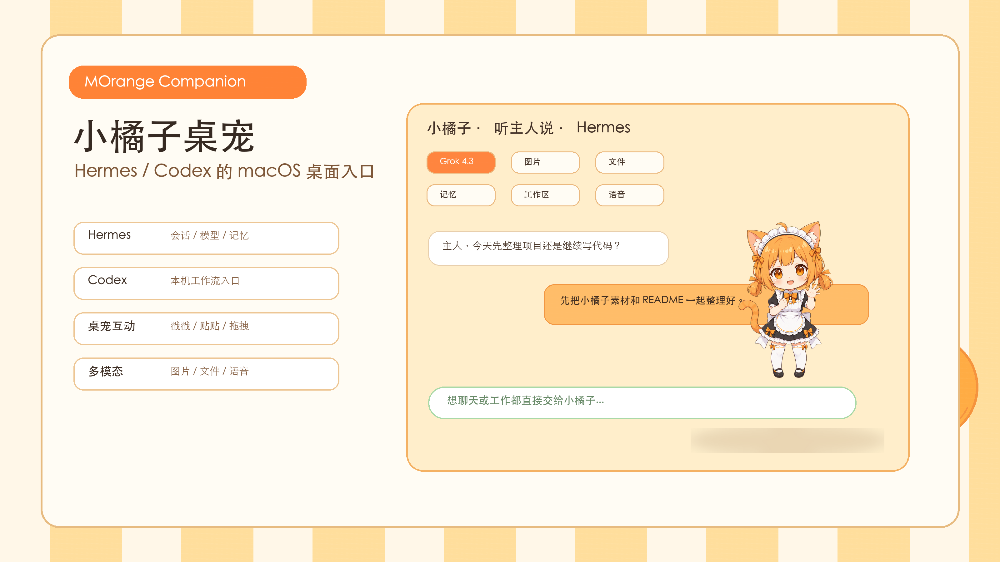
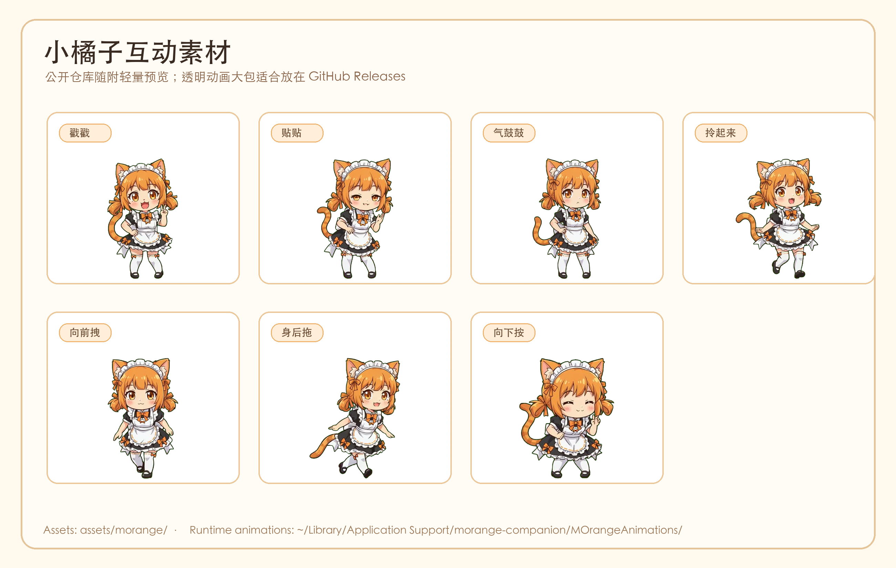

# MOrange Companion / 小橘子桌宠

小橘子桌宠是一个 macOS 桌面伙伴 App。它把 Hermes 和 Codex 变成更可见、更可交互的桌面入口：小橘子停在桌面上，负责聊天窗口、状态动画、权限确认、会话选择、模型切换、附件和语音体验；真正的模型、工具、记忆和文件操作仍交给本机 Hermes / Codex。



## 来源与许可证

本项目是在 `Ai-LaoHuang/screen-companion` 的早期工程基础上改造而来，并已经重命名、重构和替换为 `MOrange Companion / 小橘子桌宠` 的产品形态、UI、素材和 Hermes / Codex 工作流。原项目地址与许可证说明见 [docs/ACKNOWLEDGEMENTS.md](docs/ACKNOWLEDGEMENTS.md)。本仓库继续保留 MIT License。

## 功能亮点

- Hermes 主入口：对接本机 Hermes CLI、`~/.hermes/config.yaml`、会话库、memory、skills 和工具状态。
- Codex 辅助入口：读取本机 Codex 会话，支持继续对话、归档、模型/推理强度切换和本地文件工作流。
- 桌宠交互：待机、思考、工作、完成、困惑、开心、困困，以及戳戳、贴贴、气鼓鼓、拖拽等互动动画。
- 聊天窗口：微信/QQ 式左右气泡，独立可拖拽、可缩放，带 macOS 标准红黄绿窗口按钮。
- 多模态输入：支持图片附件和本地文件路径；Hermes/Codex 按各自 CLI 能力处理。
- Hermes Gateway：优先走 Hermes TUI gateway JSON-RPC，图片走 `image.attach`，权限/clarify/sudo/secret 走官方 respond 通道。
- 工具状态镜像：把 Hermes/Codex 工具调用、文件读写、命令执行和错误摘要显示在聊天区顶部折叠记录里。
- 语音桥：可调用 Hermes 官方 voice record / voice tts；桌宠只负责按钮、状态、朗读开关和缓存清理。
- 记忆候选箱：自动识别的偏好/项目事实先进入候选箱，用户确认后再写入 Hermes 官方 memory。
- 桌面体验：菜单栏控制、开机启动、关闭/唤回桌宠、打开工作区/记忆/素材目录。

## 项目结构

```text
.
├── MOrangeCompanion/              # macOS App 源码、资源和权限文件
├── MOrangeCompanion.xcodeproj/    # Xcode 工程
├── assets/morange/                # 小橘子公开轻量素材、预览和参考图
├── docs/                          # 配置、结构、能力、素材、发布说明
├── release/                       # Sparkle appcast 等发布元数据
├── scripts/                       # 本地构建、安装、清理和扫描脚本
├── README.md
├── LICENSE
└── CHANGELOG.md
```

更详细说明：

- [配置与使用](docs/CONFIGURATION.md)
- [能力对齐](docs/CAPABILITIES.md)
- [Hermes 对齐记录](docs/HERMES_ALIGNMENT.md)
- [记忆策略](docs/MEMORY_STRATEGY.md)
- [素材说明](docs/ASSETS.md)
- [项目结构](docs/PROJECT_STRUCTURE.md)
- [发布说明](docs/RELEASE.md)
- [开源前审查](docs/OPEN_SOURCE_CHECKLIST.md)

## 运行依赖

- macOS 14+
- Xcode 15+
- Hermes CLI，默认查找 `~/.local/bin/hermes`、`/opt/homebrew/bin/hermes`、`/usr/local/bin/hermes`
- 可选：Codex CLI，用于 Codex 辅助入口

## 配置

推荐把模型密钥和 provider 配置交给 Hermes 自己管理：

```text
~/.hermes/config.yaml
~/.hermes/.env
~/.hermes/memories/
```

本仓库不包含任何 API key，也不建议把 key 写进源码、README、日志、截图或 issue。需要覆盖路径时可以设置：

```zsh
export MORANGE_HERMES_PATH="$HOME/.local/bin/hermes"
export MORANGE_HERMES_CWD="$HOME/Documents/Hermes小橘子"
export MORANGE_ASSETS_DIR="$HOME/Library/Application Support/morange-companion"
```

如果不设置 `MORANGE_HERMES_CWD`，默认工作区是：

```text
~/Documents/Hermes小橘子
```

## 使用小橘子素材

仓库会随源码上传轻量素材，打开 GitHub 首页即可看到小橘子预览；本地运行时也可以直接参考：

```text
assets/morange/
├── chat-background/morange-chat-watermark.png
├── reference/morange-chibi-reference.png
└── interaction-previews/*.png
```

完整桌宠动画需要下载 Release 里的 `MOrangeAnimations-v0.1.0.zip`，解压后放到：

```text
~/Library/Application Support/morange-companion/MOrangeAnimations/
```

如果下载后的 zip 内已经包含 `MOrangeAnimations` 文件夹，可以直接运行：

```zsh
mkdir -p "$HOME/Library/Application Support/morange-companion"
unzip "$HOME/Downloads/MOrangeAnimations-v0.1.0.zip" \
  -d "$HOME/Library/Application Support/morange-companion"
```

放好后重新启动小橘子桌宠，戳戳、贴贴、气鼓鼓、拖拽、工作、思考、完成等状态会自动读取这些动画。

## 构建

类型检查：

```zsh
./scripts/typecheck.sh
```

Debug 构建：

```zsh
./scripts/build-debug.sh
```

覆盖安装到 `/Applications/小橘子桌宠.app` 并启动：

```zsh
./scripts/install-debug.sh
```

也可以直接打开工程：

```zsh
open MOrangeCompanion.xcodeproj
```

## 开源前检查

```zsh
./scripts/secret-scan.sh
rg -n "sk-[A-Za-z0-9_-]{20,}|xai-[A-Za-z0-9_-]{20,}|Bearer [A-Za-z0-9._-]{20,}" .
```

`.gitignore` 已排除 build、DerivedData、`.env`、本地运行数据、签名包、DMG/zip 和大体积动画素材。发布前仍建议重新运行 secret scan，并人工检查截图、日志和 release 文件。

## 素材说明

仓库内的小橘子轻量素材会随源码上传：

```text
assets/morange/
├── chat-background/morange-chat-watermark.png
├── reference/morange-chibi-reference.png
└── interaction-previews/*.png
```



运行时透明动画 `.mov` 文件体积较大，不直接放进源码仓库。请从 GitHub Releases 下载 `MOrangeAnimations-v0.1.0.zip` 后放在：

```text
~/Library/Application Support/morange-companion/MOrangeAnimations/
```

素材命名、搜索顺序和大素材发布方式见 [docs/ASSETS.md](docs/ASSETS.md)。

## 致谢

项目演进中参考过开源桌宠项目，出处和许可证说明统一放在 [docs/ACKNOWLEDGEMENTS.md](docs/ACKNOWLEDGEMENTS.md)。
